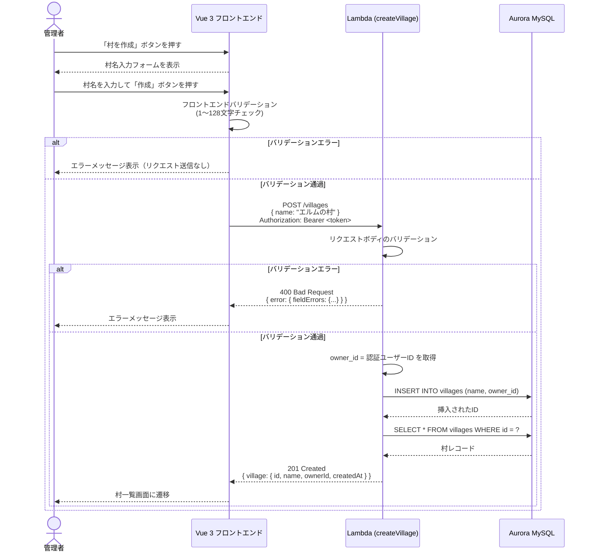
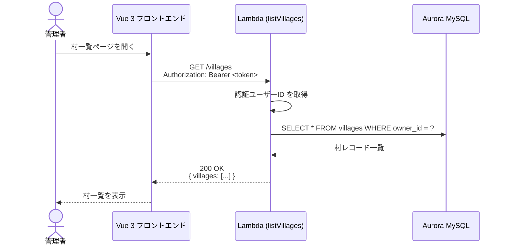

# 詳細設計 — 村管理（village）

## 対象読者

村管理機能の仕様（何を・なぜ作るか）の合意を記録したドキュメント。
API 仕様・バリデーションルール・エラー方針・設計上の判断を確認するために参照する。

---

## 処理フロー詳細

認証・ユーザーID 取得・権限チェックの共通パターンは [api-architecture.md](../non-functional/api-architecture.md) を参照。

### 村を作成する



### 村一覧を取得する



---

## API 詳細

### POST /villages — 村を作成する

**リクエスト**

```
Headers:
  Content-Type: application/json
  Authorization: Bearer <JWT>   ※ PBI-014 実装前はモック認証

Body:
  {
    "name": "エルムの村"
  }
```

**バリデーション**

| フィールド | ルール | エラー時 |
|---|---|---|
| name | 必須・文字列 | `fieldErrors.name` に配列で返す |
| name | 1文字以上 | 同上 |
| name | 128文字以下 | 同上 |

**レスポンス**

| ステータス | 条件 | ボディ |
|---|---|---|
| 201 Created | 正常作成 | `{ "village": { "id": 1, "name": "エルムの村", "ownerId": "user-123", "createdAt": "2026-05-05T00:00:00.000Z" } }` |
| 400 Bad Request | バリデーションエラー | `{ "error": { "fieldErrors": { "name": ["..."] } } }` |
| 400 Bad Request | JSON パース失敗 | `{ "error": "Invalid JSON" }` |
| 401 Unauthorized | 未認証 | `{ "error": "Unauthorized" }` |

---

### GET /villages — 自分の村一覧を取得する

**リクエスト**

```
Headers:
  Authorization: Bearer <JWT>
```

**レスポンス**

| ステータス | 条件 | ボディ |
|---|---|---|
| 200 OK | 正常取得 | `{ "villages": [ { "id": 1, "name": "エルムの村", "ownerId": "user-123", "createdAt": "..." } ] }` |
| 401 Unauthorized | 未認証 | `{ "error": "Unauthorized" }` |

**取得ルール:**
- `owner_id = 認証ユーザーID` の条件でフィルタする
- 他ユーザーの村は返さない
- 空配列も正常レスポンス（`200 OK`、`{ "villages": [] }`）
- **ソート順: `created_at DESC`（最新作成順）** — 将来のページネーション対応を見越して API 側でソートする（フロントでのソートはページまたぎで正確に機能しないため）

---

## データモデル詳細

テーブル定義・Drizzle ORM スキーマ・マイグレーション方針・CRUD表は [データモデル](../data-model/village.md) を参照すること。

---

## フロントエンドコンポーネント設計

### ページ構成

| パス | 役割 |
|---|---|
| `/villages` | 村一覧ページ |
| `/villages/new` | 村作成ページ |

認証ガード: PBI-014 実装前はモック認証で保護する。未認証の場合はログイン画面にリダイレクト。

---

### フロントエンドの状態管理

村一覧画面と村作成画面は状態（一覧データ・ローディング・エラー）を共有する。
以下の状態を保持する。

- 自分の村一覧（GET /villages の結果）
- ローディング状態（API 呼び出し中）
- エラー状態（最後のリクエストが失敗したか）

ページ遷移しても一覧データを再取得するのではなく、村作成後に一覧を再フェッチする。

---

### 村一覧画面

**責務:** 村一覧の表示、村作成ページへのナビゲーション

**構成:**
- 村リストを表示するコンポーネント
- 「村を作成」ボタン: 村作成ページに遷移する
- ローディング状態の表示
- エラーメッセージの表示

---

### 村作成画面

**責務:** 村作成フォームの表示と送信

**フォーム要素:**
- 村名入力フィールド（最大 128 文字）
- 作成ボタン（送信中はローディング表示）
- バリデーションエラーメッセージ

**バリデーション（フロントエンド側）:**

| 条件 | メッセージ |
|---|---|
| 村名が空 | 「村名を入力してください」 |
| 村名が128文字超 | 「村名は128文字以内で入力してください」 |

**送信後の動作:**
- 成功時: 村一覧ページにリダイレクト
- 失敗時: APIのエラーメッセージを表示

---

## エラーハンドリング方針

| レイヤー | エラー種別 | 対応 |
|---|---|---|
| フロントエンド | バリデーションエラー | フォーム下部にエラーメッセージを表示。API呼び出しは行わない |
| フロントエンド | APIエラー (400) | `error.fieldErrors` を解析してフィールドごとに表示 |
| フロントエンド | APIエラー (401) | ログインページにリダイレクト |
| フロントエンド | APIエラー (403) | 「操作する権限がありません」を表示 |
| フロントエンド | ネットワークエラー | 「通信エラーが発生しました。再試行してください」を表示 |
| API | JSON パース失敗 | 400 `{ "error": "Invalid JSON" }` |
| API | バリデーションエラー | 400 `{ "error": { "fieldErrors": {...} } }` |
| API | 未認証 | 401 `{ "error": "Unauthorized" }` |
| API | 権限エラー | 403 `{ "error": "Forbidden" }` |
| API | DB エラー | 500 `{ "error": "Internal Server Error" }`（詳細はログのみ） |

---

## 実装上の注意点

### 認証との連携

- PBI-014（ログイン機能）が未実装の段階では、`owner_id` に固定値（例: `"mock-user-1"`）を使用したモック認証で開発を進める
- モックと本番の切り替えは環境変数またはハンドラーの依存注入で行う

### owner_id の取得方法

- 本番環境: API Gateway の Authorizer が JWT を検証し、Lambda のイベントに `requestContext.authorizer.userId`（または同等）を付与する
- ローカル/テスト: ヘッダー `X-User-Id` または固定モック値を使用する

### トランザクション境界

- 村の INSERT は単一の SQL 文で完結するため、明示的なトランザクション管理は不要
- 挿入後の ID を取得し、続けて SELECT する（既存の `createItem` ハンドラーと同じパターン）

### 一覧取得のパフォーマンス

- `owner_id` にインデックスを設けることで、ユーザーごとの村数が増えてもクエリ性能を維持する
- 現時点ではページネーションなし（村数が多くなるフェーズで PBI を起こして追加する）

### 他ユーザー村の編集ガード

- バックエンドで `owner_id = 認証ユーザーID` の確認を必ず実施する（フロントエンドだけのガードは不十分）
- 将来の編集系エンドポイント（PUT /villages/:id など）では必ずこのチェックを実装する

---

## テスト方針

### ユニットテスト（small）

対象: 村作成ハンドラー（小）、村一覧ハンドラー（小）
- DB モックを使用
- バリデーションエラーケース（400）を網羅する

### 統合テスト（medium）

対象: 村作成ハンドラー（中）、村一覧ハンドラー（中）
- Testcontainers の MySQL コンテナを使用
- 正常系・異常系を DB 含めて確認する
- 既存の `mysql-setup.ts` ヘルパーを再利用する

### フロントエンドテスト

対象: 村一覧コンポーネント、村作成コンポーネント
- コンポーネントの動作を確認する
- Pinia ストアのモックを使用する

---

## 変更履歴

| PBI | 変更日 | 変更内容 |
|---|---|---|
| PBI-001 | 2026-05-05 | 村管理機能の初期詳細設計（作成・一覧・権限ガード） |
| PBI-019 | 2026-05-30 | ハンドラーパスを `src/handlers/` → `src/village/` に更新（feature別フォルダ構成への移行） |
| PBI-020 | 2026-05-31 | フロントエンドパスを `src/views/` / `src/stores/` → `src/features/village/` に更新（feature別フォルダ構成への移行） |
| PBI-022 | 2026-05-31 | 実装コード・ファイルパスを除去し「仕様の合意記録」に再編 |
