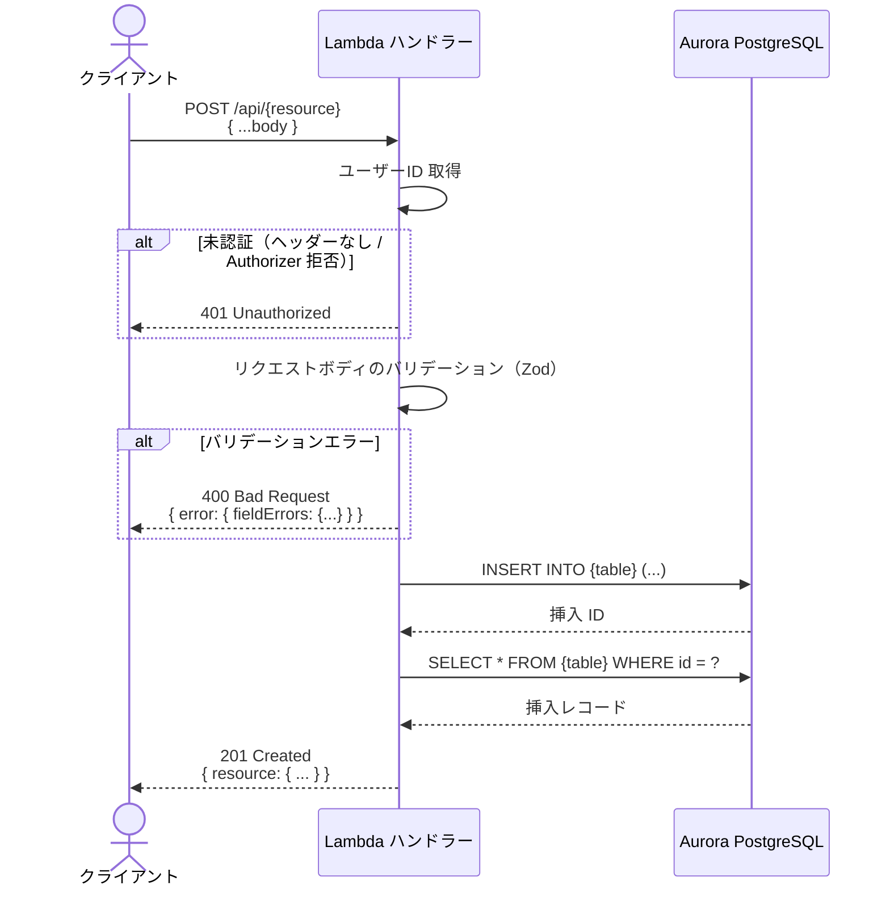
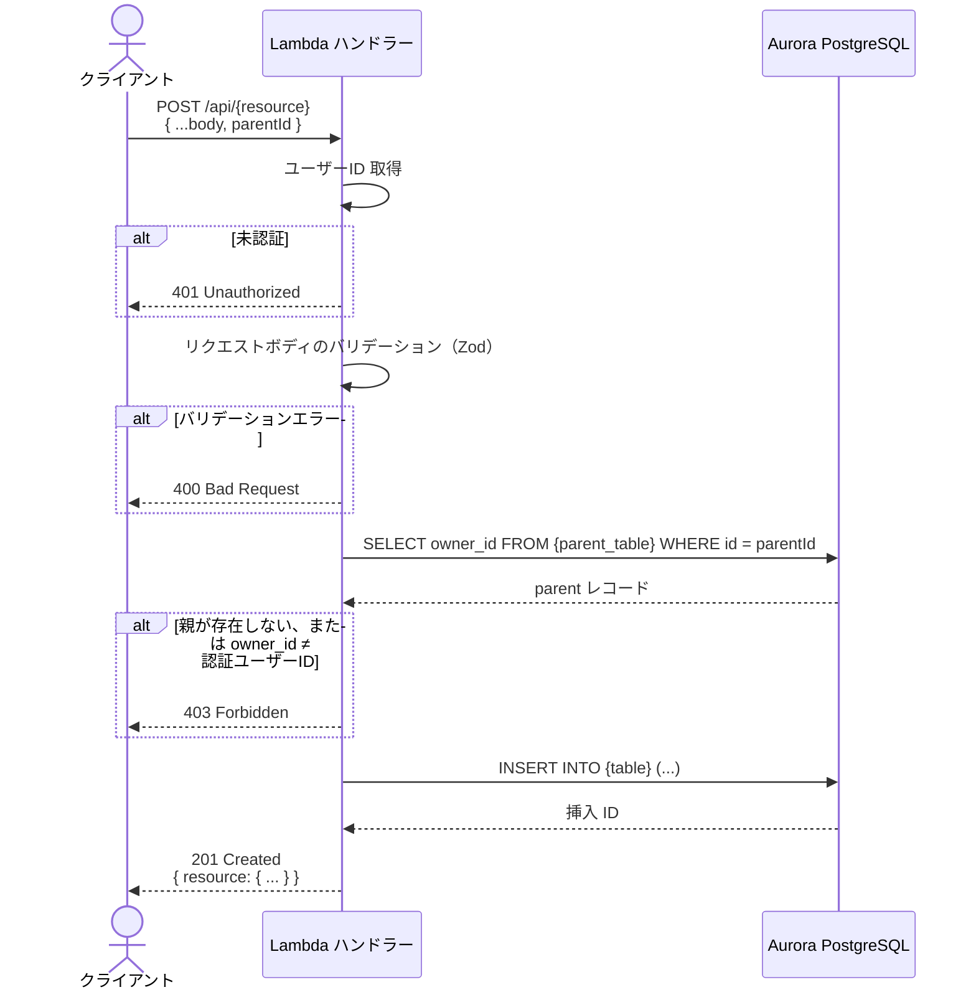
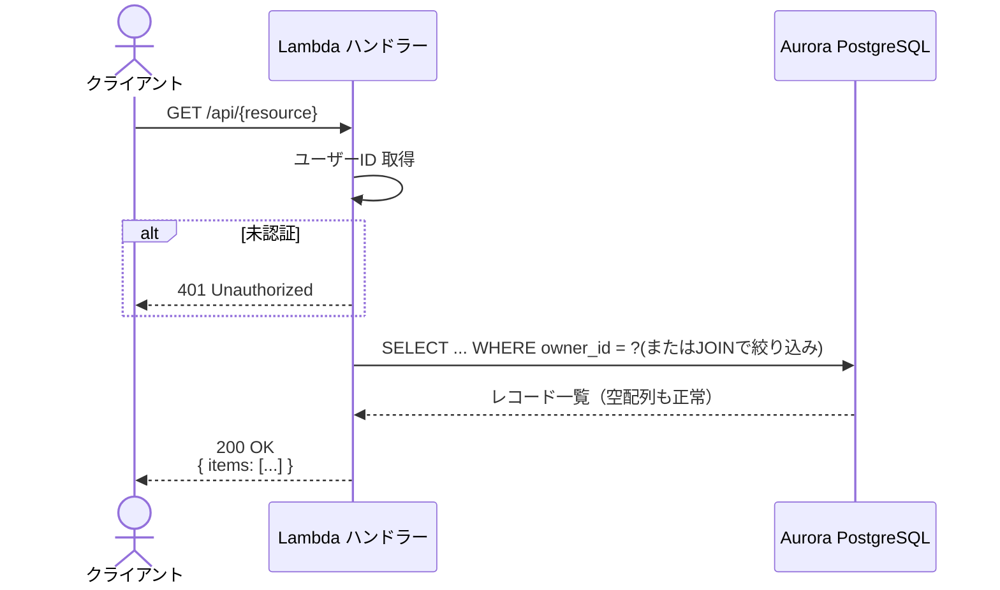

# API アーキテクチャ — リクエスト処理の代表パターン

## 対象読者

API ハンドラーを実装する開発者。認証・ユーザーID 取得・権限チェックの共通パターンを把握し、
各詳細設計ドキュメントのシーケンス図を読む際の前提知識として参照すること。

---

## 認証・ユーザーID 取得パターン

認証方式は PBI-014（ログイン機能）の実装前後で切り替わる。詳細は [security.md](./security.md) を参照。

| フェーズ | 取得元 | 実装 |
|---|---|---|
| 開発中（PBI-014 前） | リクエストヘッダー `X-User-Id` | `apps/api/src/auth.ts` の `getOwnerId(event)` を呼び出す |
| 本番（PBI-014 後） | API Gateway Authorizer | `event.requestContext.authorizer.userId`（PBI-014 で `auth.ts` を差し替え） |

ヘッダーが存在しない場合（開発中）または Authorizer が通過しない場合（本番）は `401 Unauthorized` を返す。

### `getOwnerId` の使い方

すべての認証が必要なハンドラーで以下のパターンを使う。直接ヘッダーを参照しないこと。

```typescript
import { getOwnerId } from '../auth';

const ownerIdOrError = getOwnerId(event);
if (typeof ownerIdOrError !== 'string') return ownerIdOrError; // 401 を早期リターン
const ownerId = ownerIdOrError;
```

`getOwnerId` のユニットテストは `apps/api/tests/small/auth.test.ts` に集約されているため、
各ハンドラーのテストで 401 ケースを個別に書く必要はない。

---

## 代表パターン 1: 認証 + バリデーション + 書き込み

新規リソースの作成など、書き込み系エンドポイントの標準フロー。



---

## 代表パターン 2: 認証 + リソース所有権チェック + 書き込み

他ユーザーのリソースへの操作を禁止する必要がある書き込み系エンドポイントのフロー。
住人登録（POST /api/residents）など、所属リソース（村）の所有権確認が必要な場合に使用する。



> 親リソースの存在確認と所有権確認をまとめて 403 で返すことで、リソースの存在を他ユーザーに推測させない。

---

## 代表パターン 3: 認証 + 読み取り（所有リソースのみ）

ログインユーザーが所有するリソース一覧を返す読み取り系エンドポイントのフロー。



---

## バリデーションエラーレスポンス形式

すべてのエンドポイントで以下の形式に統一する。詳細は [error-handling.md](./error-handling.md) を参照。

```json
{
  "error": {
    "fieldErrors": {
      "fieldName": ["エラーメッセージ"]
    }
  }
}
```

---

## タイムゾーン方針

- **バックエンド / API / DB**: すべて UTC で扱う
  - `TIMESTAMP` 型カラム（`created_at` など）は UTC で保存・返却する
  - `DATE` 型カラム（`birth_date` など）はタイムゾーンを持たない純粋な日付として扱う
- **フロントエンド**: 表示時にローカルタイムゾーンへ変換する責務を持つ
  - `createdAt` など日時を表示する場合は `Intl.DateTimeFormat` または date-fns でフォーマットする

---

## 変更履歴

| PBI | 変更日 | 変更内容 |
|---|---|---|
| PBI-003 | 2026-05-06 | 初版作成。代表パターン3種・認証方式・タイムゾーン方針を定義 |
| PBI-003 | 2026-05-10 | 認証チェックを `src/auth.ts` の `getOwnerId()` に共通化。使い方・テスト方針を追記 |
