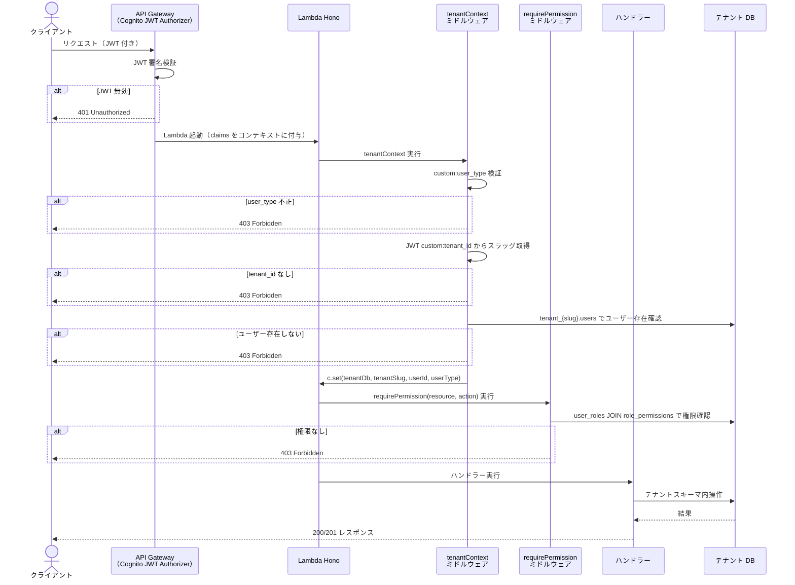
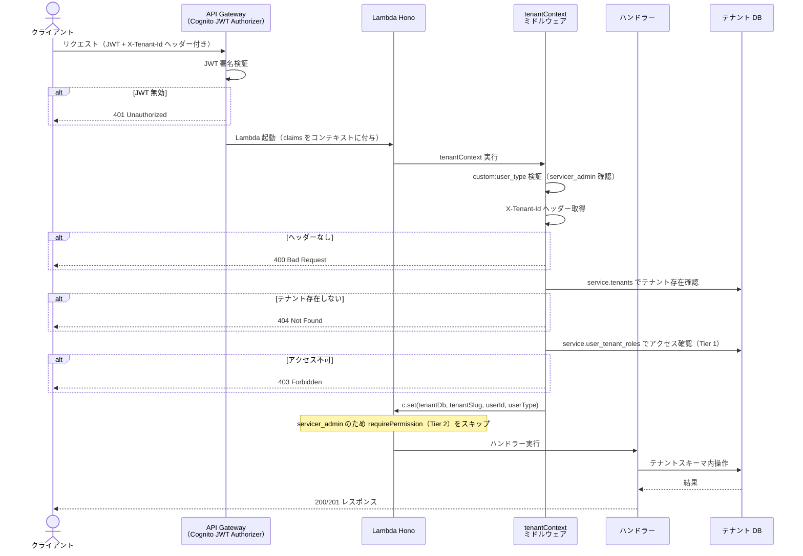

# API 認可パターン設計 — マルチテナント SaaS 対応

## 対象読者

API ハンドラーを実装する開発者。マルチテナント対応後（PBI-SaaS-001d 以降）のすべての認証済みエンドポイントで参照すること。

## 目的

Cognito JWT Authorizer + Hono ミドルウェアによる 2 段構成認可パターンを確定し、全 API ハンドラーが同じパターンに従ってテナント境界を守る実装ができるようにする。

## 対象スコープ

含むこと:
- `tenantContext` Hono ミドルウェアの設計（テナントコンテキスト解決 + Tier 1 テナントアクセス確認）
- `requirePermission(resource, action)` Hono ミドルウェアの設計（Tier 2 機能認可）
- 代表フローとシーケンス図（`tenant_*` ユーザー / `servicer_admin`）
- クロステナントアクセス拒否パターン
- ハンドラー実装例
- フロントエンド権限取得パターン
- 既存 `getOwnerId` パターンからの移行経路

含まないこと:
- `tenantContext` / `requirePermission` の実装コード（実装 PBI で対応）
- Cognito Authorizer の CDK 実装

---

## 認可 2 段構成の概要

API Gateway + Lambda 構成で認可を 2 段階に分割する。

| 段階 | 担当 | 責務 |
|---|---|---|
| API Gateway | Cognito JWT Authorizer | JWT 署名検証のみ。検証済みの claims を Lambda コンテキストに渡す |
| Tier 1 | `tenantContext` ミドルウェア | テナントスラッグ解決 + テナントアクセス確認 |
| Tier 2 | `requirePermission(resource, action)` ミドルウェア | DB ベースの機能認可。`servicer_admin` はスキップ |

Lambda 内のルーティングとミドルウェア集約には **Hono** を使用する。

---

## `tenantContext` ミドルウェア設計

**役割**: テナントコンテキストの解決と Tier 1 テナントアクセス確認

### `tenant_*` ユーザーのフロー

1. JWT の `custom:user_type` を検証（想定 4 値以外 → 403）
2. JWT の `custom:tenant_id` からテナントスラッグを取得（存在しない場合 → 403）
3. スラッグをスキーマ名に変換（ハイフン→アンダースコア: `tenant_{schema_name}`）
4. `tenant_{slug}.users` でユーザー存在確認（存在しない → 403）
5. Hono context に `tenantDb`（テナント DB 接続）と `tenantSlug` をセット

### `servicer_*` ユーザーのフロー

1. JWT の `custom:user_type` を検証
2. `X-Tenant-Id` ヘッダーからテナントスラッグを取得（ヘッダーなし → 400）
3. `service.tenants` でテナント存在確認（存在しない → 404）
4. `service.user_tenant_roles` でこのユーザーが対象テナントにアクセスできるか確認（不可 → 403）
5. Hono context に `tenantDb` と `tenantSlug` をセット

### エラー一覧

| 条件 | 経路 | ステータス |
|---|---|---|
| `custom:user_type` が想定 4 値以外 | 共通 | 403 Forbidden |
| JWT に `sub` がない | 共通 | 403 Forbidden |
| `tenant_*` の JWT に `custom:tenant_id` がない | tenant_* | 403 Forbidden |
| `servicer_*` のリクエストに `X-Tenant-Id` ヘッダーがない | servicer_* | 400 Bad Request |
| テナントスラッグが `service.tenants` に存在しない | servicer_* | **404 Not Found** |
| テナントの `status` が `'active'` 以外（suspended / deleted 等） | servicer_* | **403 Forbidden** |
| テナントスキーマが存在しない / インフラ接続エラー | tenant_* | 503 Service Unavailable |
| テナントスキーマが inactive または接続エラー | tenant_* | 503 Service Unavailable |
| Tier 1: テナントアクセス不可（ユーザーがテナントに属していない） | 共通 | 403 Forbidden |

> **servicer 経路の 404/403 分離の理由（PBI-SaaS-004b）**: `servicer_*` ユーザーは任意の `X-Tenant-Id` を送れるため、503 を返すとスラッグの存在有無が推測できる（列挙攻撃）。存在しない場合は 404、存在するが停止中の場合は 403 を返すことで、スラッグを存在していないスラッグと区別する情報を提供しない。

### Hono context へのセット

```typescript
c.set('tenantDb', tenantDb);
c.set('tenantSlug', slug);
c.set('userId', userId);
c.set('userType', userType);
```

---

## `requirePermission(resource, action)` ミドルウェア設計

**役割**: Tier 2 機能認可（DB ベースの resource × action チェック）

### フロー

1. `c.get('userType')` で `servicer_admin` なら **スキップ**（全権限）
2. `c.get('userId')` と `c.get('tenantDb')` を取得
3. `tenant_{slug}.user_roles` JOIN `tenant_{slug}.role_permissions` で `resource` × `action` の組み合わせを確認
4. 一致なし → 403 Forbidden

`servicer_admin` が Tier 2 をスキップする根拠: サービス全体を管理する立場のため全テナント・全操作への権限を持つ設計とする。

### エラー

| 条件 | ステータス |
|---|---|
| Tier 2: 権限なし | 403 Forbidden |

---

## 代表フローとシーケンス図

### パターン A: `tenant_*` ユーザーのリクエスト処理フロー



### パターン B: `servicer_admin` のリクエスト処理フロー



---

## クロステナントアクセス拒否パターン

- `tenant_*` ユーザーは JWT の `custom:tenant_id` のテナントにしかアクセスできない
- `tenant_*` ユーザーのリクエストに `X-Tenant-Id` ヘッダーがあっても無視する（JWT `custom:tenant_id` を優先）
- Drizzle の接続を切り替えた後はそのセッション内でテナントスキーマ外のテーブルを参照するコードを書かない

これらは `tenantContext` ミドルウェアで設計レベルから排除する。各ハンドラーでクロステナント対策を個別に実装しない。

---

## ハンドラー実装例

薄いハンドラーに `tenantContext` と `requirePermission` を組み合わせる。

```typescript
// app.ts
app.post('/residents', tenantContext, requirePermission('resident', 'create'), createResidentHandler);

// createResidentHandler.ts
export const createResidentHandler: Handler = async (c) => {
  const tenantDb = c.get('tenantDb');
  const userId = c.get('userId');
  // tenantDb を使ってテナントスキーマ内のみ操作する
  const body = await c.req.json();
  const resident = await createResident(tenantDb, userId, body);
  return c.json({ resident }, 201);
};
```

ハンドラーは `tenantDb` / `userId` の取得と `createResident` の呼び出しのみ担当し、テナント解決・認可チェックはミドルウェアに委ねる。

---

## フロントエンド権限取得パターン

- エンドポイント: `GET /api/my/permissions?tenant={slug}`
- レスポンス: `{ permissions: [{ resource: string, action: string }] }`
- Pinia store でパーミッションリストを管理し、画面コンポーネントで `canDo(resource, action)` 関数を使って UI 制御する

フロントエンド側のガード（ボタン非表示・ルートガードなど）は UX のためのものであり、認可の最終判断は常に API 側で行う。

---

## 既存 `getOwnerId` パターンからの移行経路

| 比較項目 | 旧: `getOwnerId` パターン | 新: Hono ミドルウェアパターン |
|---|---|---|
| ユーザーID 取得 | `getOwnerId(event)` | `c.get('userId')` |
| テナント識別 | なし | `c.get('tenantSlug')` |
| DB 接続 | 共通接続 | `c.get('tenantDb')`（テナントスキーマ切替済み） |
| 認可チェック | `owner_id` 一致確認 | `requirePermission(resource, action)` |

- 現在: `apps/api/src/shared/auth.ts` の `getOwnerId(event)` でユーザーID を取得
- 移行後: `tenantContext` ミドルウェアの `c.get('userId')` からユーザーID を取得
- 移行は実装 PBI で段階的に行う（既存ハンドラーを順次 Hono + ミドルウェアパターンに置き換える）

---

## 変更履歴

| PBI | 変更日 | 変更内容 |
|---|---|---|
| PBI-SaaS-001d | 2026-06-17 | 初版作成。tenantContext / requirePermission ミドルウェア設計・代表フロー・クロステナント拒否パターン・ハンドラー例・フロントエンド権限取得パターンを定義 |
| PBI-SaaS-004b | 2026-06-21 | servicer_* 経路のエラー一覧を更新。503 を「スラッグ不在 → 404」「非 active → 403」「インフラ接続エラー → 503」に分離。列挙攻撃対策の根拠を追記 |
