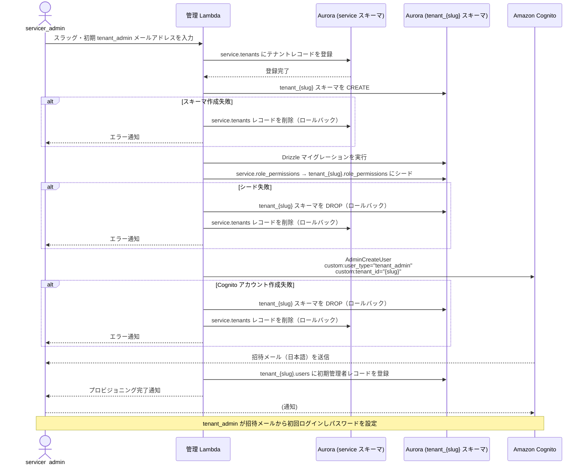
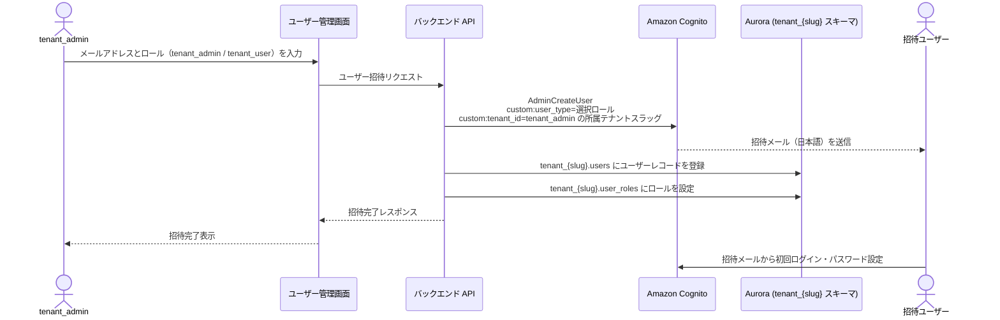
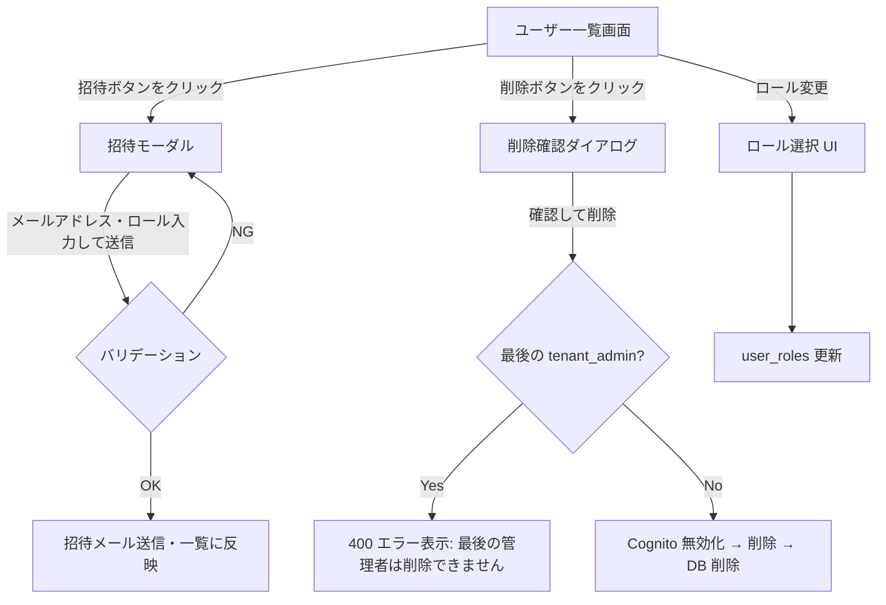

# テナントプロビジョニング・ユーザー管理フロー設計

## 対象読者・目的

**対象読者**: バックエンドエンジニア・フロントエンドエンジニア・インフラエンジニア

**目的**: マルチテナント SaaS における 4 アクター（`servicer_admin` / `servicer_delegate` / `tenant_admin` / `tenant_user`）それぞれが、いつ・どの手順で操作するかを確定する。本ドキュメントをもとにユーザー管理画面・プロビジョニング Lambda の実装 PBI を定義する。

**対象スコープ**

- 含む: テナントプロビジョニングフロー・`servicer_delegate` 作成フロー・テナント内ユーザー管理フロー（招待・削除・ロール変更）・操作権限マトリクス・ユーザー管理画面フロー概要
- 含まない: Cognito User Pool の CDK 実装・ユーザー管理画面の Vue コンポーネント実装・テナントプロビジョニング Lambda の実装・課金・契約管理フロー

---

## アクター定義

| 識別子 | 名称 | テナントアクセス |
|---|---|---|
| `servicer_admin` | サービサーのシステム管理者 | 全テナント（テナント切り替えあり） |
| `servicer_delegate` | サービサーの管理移譲アルバイター | 割り当てテナント群 |
| `tenant_admin` | テナントシステム管理者 | 自テナントのみ |
| `tenant_user` | テナント一般利用者 | 自テナントのみ |

---

## 操作権限マトリクス

| 操作 | `servicer_admin` | `servicer_delegate` | `tenant_admin` | `tenant_user` |
|---|---|---|---|---|
| テナント発行 | ✓ | ✗ | ✗ | ✗ |
| `servicer_delegate` 作成 | ✓ | ✗ | ✗ | ✗ |
| テナント内ユーザー招待（`tenant_admin` / `tenant_user`） | ✓（管理 Lambda 経由） | ✗ | ✓（自テナントのみ） | ✗ |
| テナント内ユーザー削除 | ✓ | ✗ | ✓（自テナントのみ） | ✗ |
| ロール割り当て変更 | ✓ | ✗ | ✓（自テナントのみ） | ✗ |
| `servicer_*` ロールの付与 | ✓ | ✗ | ✗ | ✗ |

**重要な制約**:

- `tenant_admin` は自テナント外の操作を一切行えない
- `tenant_admin` が追加できるのは同テナント内の `tenant_admin` / `tenant_user` のみであり、`servicer_*` ロールの付与は不可
- テナント発行・`servicer_delegate` 作成は `servicer_admin` のみが実行できる

---

## テナントプロビジョニングフロー

**実行主体**: `servicer_admin`
**操作手段**: 管理 Lambda（API 経由）

### ロールバック手順まとめ

| 失敗箇所 | ロールバック操作 |
|---|---|
| Aurora スキーマ作成失敗 | `service.tenants` レコードを削除 |
| Drizzle マイグレーション / シード失敗 | `tenant_{slug}` スキーマを DROP し、`service.tenants` レコードを削除 |
| Cognito アカウント作成失敗 | `tenant_{slug}` スキーマを DROP し、`service.tenants` レコードを削除 |

---

## `servicer_delegate` 作成フロー

**実行主体**: `servicer_admin` のみ（`servicer_delegate` 自身は作成不可）

1. `servicer_admin` がメールアドレスとアクセス可能テナントを決定する
2. 管理 Lambda が Cognito AdminCreateUser でアカウントを作成する
   - `custom:user_type: "servicer_delegate"`
   - `custom:tenant_id` は設定しない（複数テナントへのアクセスは `service.user_tenant_roles` で管理）
3. 管理 Lambda が `service.users` にユーザーレコードを登録する
4. 管理 Lambda が `service.user_tenant_roles` でアクセス可能テナントと役割を設定する

---

## テナント内ユーザー管理フロー（`tenant_admin` 操作）

`tenant_admin` はテナントユーザーの管理を **SaaS アプリ内のユーザー管理画面** から行う。Cognito コンソールへのアクセス権限は付与しない。

### ユーザー招待フロー

**招待メール未達時**: `tenant_admin` は管理画面から再送信を実行できる（Cognito ResendConfirmationCode 等を使用）。

### ユーザー削除フロー

1. `tenant_admin` がユーザー管理画面で削除対象を選択する
2. バックエンド API がテナント内の `tenant_admin` 数を確認する
   - 削除対象が最後の `tenant_admin` の場合、400 エラーで拒否する
3. Cognito AdminDisableUser を実行してアカウントを無効化する（削除前に先行して無効化することで、JWT の次リクエストを 403 にする）
4. Cognito AdminDeleteUser を実行してアカウントを削除する
5. `tenant_{slug}.user_roles` のレコードを削除する
6. `tenant_{slug}.users` のレコードを削除する

**削除後の動作**: 削除対象ユーザーが保持する JWT は、Cognito 無効化（ステップ 3）以降の次リクエストで 403 になる。

### ロール変更フロー

1. `tenant_admin` がユーザー管理画面でロールを変更する
2. バックエンド API が `tenant_{slug}.user_roles` を更新する

`servicer_*` ロールは `tenant_admin` からは付与できない。付与しようとした場合はバックエンドで 403 を返す。

---

## ユーザー管理画面フロー設計

**各画面の責務**:

- ユーザー一覧画面: テナント内ユーザーの一覧表示・招待ボタン・削除ボタン・ロール変更 UI を提供する
- 招待モーダル: メールアドレス入力・ロール選択（`tenant_admin` / `tenant_user`）・送信を行う
- 削除確認ダイアログ: 削除前の確認を促す。最後の `tenant_admin` を削除しようとした場合はエラーメッセージを表示して操作を拒否する

**PO 向けドキュメント・開発者向けドキュメント**:

本ドキュメントはフロー定義のみを扱う。

- PO 向けワイヤーフレーム・画面遷移図: `docs/design/screen/` 配下に別途作成する
- 開発者向けコンポーネント設計・API 仕様: `docs/design/detail/screen/` 配下に別途作成する

---

## 変更履歴

| PBI | 変更日 | 変更内容 |
|---|---|---|
| PBI-SaaS-001c | 2026-06-17 | 初版作成。テナントプロビジョニングフロー・servicer_delegate 作成フロー・テナント内ユーザー管理フロー・操作権限マトリクスを定義 |
