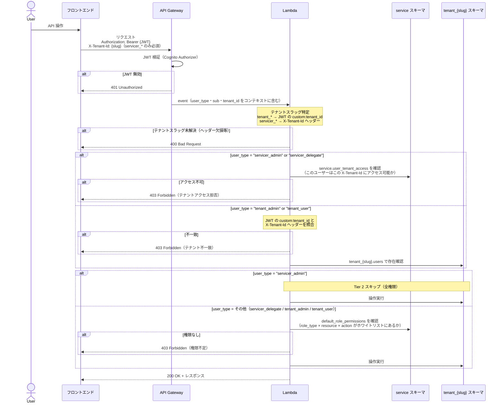

# 認証認可設計（PBI 作成前検討用）

作成日: 2026-06-17 / ステータス: 検討中

---

## このドキュメントの目的

マルチテナント SaaS 化に向けた認証・認可のアーキテクチャを整理し、
後続の PBI を正確に定義するための共通認識を作る。
実装 PBI はこのドキュメントが確定してから定義する。

---

## 登場人物（アクター定義）

| 識別子 | 名称 | 所属 | 定義 |
|---|---|---|---|
| `servicer_admin` | サービサーのシステム管理者 | サービサー側 | サービス提供者側の最上位管理者。全テナントまたは指定した複数テナントへのアクセス・管理が可能。テナント作成・ServicerDelegate 作成ができる |
| `servicer_delegate` | サービサーの管理移譲アルバイター | サービサー側 | サービス提供者側の補助者。指定テナント（複数可）のデータ閲覧・一部編集・削除が可能。ユーザー作成は不可 |
| `tenant_admin` | テナントシステム管理者 | テナント側 | **特定の 1 テナントにのみ** 所属するシステム管理者。テナント内のユーザー追加・削除・他の TenantAdmin の追加ができる |
| `tenant_user` | テナント一般利用者 | テナント側 | **特定の 1 テナントにのみ** 所属する通常利用者。アクション単位のホワイトリスト認可で機能を制限 |

**サービサー側とテナント側の本質的な違い**

| 観点 | `servicer_*` | `tenant_*` |
|---|---|---|
| アクセスできるテナント数 | 複数（全テナントまたは指定テナント群） | 1 テナントのみ（変更不可） |
| テナント切り替え | あり（UI でドロップダウン選択） | なし（ログイン時に確定） |
| JWT の `custom:tenant_id` | 持たない（複数テナントに属するため） | 持つ（単一テナントがアカウント作成時に確定） |

---

## アクター別操作範囲マトリクス

| 操作 | `servicer_admin` | `servicer_delegate` | `tenant_admin` | `tenant_user` |
|---|---|---|---|---|
| テナント作成 | ✅ | ❌ | ❌ | ❌ |
| テナント切り替え | ✅（割り当てテナント間） | ✅（割り当てテナント間） | ❌（単一テナント固定） | ❌（単一テナント固定） |
| テナント内データ閲覧 | ✅ | ✅ | ✅（自テナントのみ） | ✅（権限範囲内） |
| テナント内データ編集・削除 | ✅ | ✅ | ✅ | ✅（権限範囲内） |
| テナント内ユーザー作成 | ✅ | ❌ | ✅ | ❌ |
| テナント内 TenantAdmin 追加 | ✅ | ❌ | ✅ | ❌ |
| ServicerDelegate 作成 | ✅ | ❌ | ❌ | ❌ |
| ServicerAdmin 作成 | ✅ | ❌ | ❌ | ❌ |

> `tenant_admin` が追加できる管理者は同テナント内の `tenant_admin` のみ。`servicer_*` ロールの付与はできない。
> `tenant_*` ユーザーは作成時に所属テナントが確定し、後から変更できない。

---

## 認証設計（Cognito）

### 構成方針

- **単一 Cognito User Pool**（全アクター共用、コスト最適化）
- テナントごとの分離は認可レイヤーで行い、Cognito はアイデンティティ確認のみ担う

### JWT カスタムクレーム

| クレーム | 型 | 値 | 対象ユーザー |
|---|---|---|---|
| `custom:user_type` | string | `"servicer_admin"` \| `"servicer_delegate"` \| `"tenant_admin"` \| `"tenant_user"` | 全ユーザー |
| `custom:tenant_id` | string | テナントスラッグ（例: `"acme"`） | `tenant_admin` / `tenant_user` のみ |

**`tenant_*` が `custom:tenant_id` を持ち、`servicer_*` が持たない理由**

- `tenant_admin` / `tenant_user` は所属テナントがアカウント作成時に 1 つに確定するため、JWT に埋め込める
- `servicer_admin` / `servicer_delegate` は複数テナントにアクセスするため、JWT に特定テナントを埋め込めない
- `servicer_*` のテナント選択はリクエストヘッダー `X-Tenant-Id` で行う（後述）
- テナントとユーザーの関係は DB が正として管理する（JWT はアクター種別と所属テナントのヒントのみ）

---

## テナントアクセス方式

### `tenant_*` ユーザー（テナント固定）のフロー

```
1. Cognito でログイン → JWT 取得（custom:user_type + custom:tenant_id を含む）
2. JWT の custom:tenant_id が所属テナントを示す（選択不要）
3. 全 API リクエストに X-Tenant-Id: {slug} ヘッダーを付与（JWT の custom:tenant_id と一致する値）
4. API が JWT の custom:tenant_id と X-Tenant-Id ヘッダーを照合し、不一致なら 403
```

テナント切り替えは **不要・不可**。所属テナントはアカウント作成時に確定する。

### `servicer_*` ユーザー（テナント切り替えあり）のフロー

```
1. Cognito でログイン → JWT 取得（custom:user_type のみ。custom:tenant_id なし）
2. GET /api/my/tenants → アクセス可能テナント一覧を DB から取得
3. ユーザーが UI（ドロップダウン等）でテナントを選択
4. 選択テナントスラッグを Pinia store + localStorage に保持
5. 以降の全 API リクエストに X-Tenant-Id: {slug} ヘッダーを付与
6. テナント切り替え時は選択状態を更新し、権限リストを再取得
```

JWT 再発行は **不要**。ヘッダーが切り替わるだけで API 側が DB で再検証する。

### API でのテナント特定ロジック

```ts
function getTenantSlug(event): string | null {
  const userType = event.requestContext.authorizer.claims['custom:user_type'];

  if (userType === 'tenant_admin' || userType === 'tenant_user') {
    // JWT に確定テナントが入っている。ヘッダーとの一致を検証する
    return event.requestContext.authorizer.claims['custom:tenant_id'] ?? null;
  }

  // servicer_* はヘッダーから取得
  return event.headers['X-Tenant-Id'] ?? null;
}
```

---

## 認可設計

### モデル: ホワイトリスト RBAC

- ユーザーはテナントごとにロール（role）を持つ
- ロールはパーミッション（許可リスト）を持つ
- **明示的に許可されていない操作はすべて拒否**（ホワイトリスト）

### パーミッションの表現形式

```ts
type Permission = {
  resource: string;  // 対象リソース（例: "user", "village", "simulation"）
  action: string;    // 操作種別（例: "create", "read", "update", "delete", "list", "run"）
};
```

パーミッション例:

| resource | action | 対象操作 |
|---|---|---|
| `user` | `create` | ユーザー作成 |
| `user` | `delete` | ユーザー削除 |
| `user` | `list` | ユーザー一覧閲覧 |
| `village` | `create` | 村作成 |
| `village` | `update` | 村編集 |
| `simulation` | `run` | シミュレーション実行 |

### 認可チェックの 2 段構成

| 段階 | チェック内容 | 参照テーブル |
|---|---|---|
| Tier 1: テナントアクセス | このユーザーはこのテナントにアクセスできるか | `service.user_tenant_roles` |
| Tier 2: 機能認可 | このユーザーはこの操作を実行できるか | `service.default_role_permissions`（または tenant 固有の overrides） |

### `servicer_admin` の特例

`servicer_admin` はテナントアクセス（Tier 1）が確認されれば、Tier 2 の機能認可チェックを skip し、全権限で操作できる。

理由: サービス全体を管理する立場であるため、機能ごとの細かい制御は行わない。

### ロールは固定セットのみ（カスタムロールなし）

`tenant_admin` によるカスタムロールの定義は現時点では行わない。
全アクターのパーミッションは `service.default_role_permissions` の固定セットで管理する。

### `servicer_delegate` の確定パーミッション

| resource | action | 可否 |
|---|---|---|
| （全リソース） | `read` / `list` | ✅ |
| `resident` | `create` | ✅ |
| `resident` | `update` | ✅ |
| `resident` | `delete` | ❌ |
| `user` | `create` / `update` / `delete` | ❌ |
| （その他の write 系） | `create` / `update` / `delete` | ❌（別途 PBI で確定） |

> `default_role_permissions` の完全な初期定義は「認可テーブル設計 PBI」で確定する。

---

## DB スキーマ構成

### スキーマ一覧

| スキーマ名 | 用途 | アクセス元 |
|---|---|---|
| `service` | サービサー管理。全ユーザー・テナント・アクセス制御・デフォルト権限 | 全テナントの Lambda |
| `common` | 全テナントから参照可能な共通マスタデータ | 全テナントの Lambda |
| `tenant_{slug}` | テナント固有のビジネスデータ・カスタムロール・権限 | テナント選択後の Lambda |

### `service` スキーマ（サービサー側ユーザーと全体管理）

```
service.users
  - id           UUID PK
  - cognito_sub  string UNIQUE   ← Cognito の sub クレーム
  - email        string
  - user_type    'servicer_admin' | 'servicer_delegate'
  - created_at   datetime
  ※ servicer_* のみ。tenant_* は各テナントスキーマで管理

service.tenants
  - id           UUID PK
  - slug         string UNIQUE   ← URL・スキーマ名に使用
  - name         string
  - status       'active' | 'suspended'
  - created_at   datetime

service.user_tenant_access
  - user_id      → service.users.id
  - tenant_id    → service.tenants.id
  - role_type    'servicer_admin' | 'servicer_delegate'
  - created_at   datetime
  PK: (user_id, tenant_id)
  ※ servicer_* ユーザーがアクセス可能なテナントと、そのテナントでの役割を管理
  ※ テナントごとに role_type が異なる場合に対応（例: A テナントは admin、B テナントは delegate）

service.default_role_permissions
  - role_type    string
  - resource     string
  - action       string
  PK: (role_type, resource, action)
  ※ 全 role_type のパーミッション定義（ホワイトリスト）
```

### `common` スキーマ（全テナント共通マスタ）

全テナントから参照可能な共通マスタデータを置く。
具体的なテーブルは DB 設計 PBI で確定する。

### `tenant_{slug}` スキーマ（テナント側ユーザーとビジネスデータ）

```
tenant_{slug}.users
  - id           UUID PK
  - cognito_sub  string UNIQUE   ← Cognito の sub クレーム
  - email        string
  - user_type    'tenant_admin' | 'tenant_user'
  - created_at   datetime
  ※ このテナントに属するユーザーのみ。servicer_* はここに存在しない

＋ ビジネスデータ（villages, residents, jobs, simulations 等）
  docs/design/data-model/ に定義済みのテーブルはすべてここに属する
```

パーミッション関連テーブル（roles / role_permissions）は **`tenant_{slug}` には置かない**。
ユーザーのロールは `user_type` カラムで、パーミッション定義は `service.default_role_permissions` で一元管理する。

**ユーザー特定の分岐まとめ（Hono ミドルウェア内）：**

| user_type（JWT） | ユーザーレコードの参照先 | テナントアクセス確認先 |
|---|---|---|
| `servicer_admin` / `servicer_delegate` | `service.users` | `service.user_tenant_access` |
| `tenant_admin` / `tenant_user` | `tenant_{slug}.users`（JWT の `custom:tenant_id` から特定） | 不要（JWT に確定テナントが入っている） |

---

## API 実装方針：Hono ミドルウェアで認可を集約

### 採用方針

- **Cognito JWT Authorizer**（API Gateway）: JWT の署名検証のみ担当。claims を Lambda コンテキストに渡す
- **Hono**（Lambda 内）: ルーティングとミドルウェアを担当。認可チェックをミドルウェアとして集約する

### Lambda の処理レイヤー

```
API Gateway (Cognito JWT Authorizer)
  ↓ JWT 検証済み claims をコンテキストに付与
Lambda → Hono Router
  ↓ middleware 1: テナントコンテキスト取得（tenant slug 解決 + DB アクセス可否確認）
  ↓ middleware 2: パーミッションチェック（endpoint ごとに required permission を宣言）
Handler（薄い。ビジネスロジック呼び出しのみ）
```

### ミドルウェアの役割

| ミドルウェア | 処理内容 |
|---|---|
| `tenantContext` | user_type に応じて JWT / ヘッダーからテナントスラッグを解決。`service.user_tenant_roles` でアクセス可否を確認。テナント DB 接続を context にセット |
| `requirePermission(resource, action)` | `service.default_role_permissions` を参照し、ロールに該当パーミッションがあるか確認。`servicer_admin` は skip |

### ハンドラーの例

```ts
// apps/api/src/resident/handler.ts
app.post(
  '/residents',
  tenantContext,
  requirePermission('resident', 'create'),
  async (c) => {
    const body = await c.req.json();
    const db = c.get('tenantDb');  // ミドルウェアがセット済み
    const result = await createResident(db, body);
    return c.json(result, 201);
  }
);
```

---

## API 認可フロー



---

## フロントエンド認可

### 権限取得フロー

1. ログイン後・テナント切り替え後に `GET /api/my/permissions?tenant={slug}` を呼び出す
2. API がユーザーの全パーミッションリスト（`[{ resource, action }]`）を返す
3. Pinia store に保存し、テナント切り替え時に再取得

### 適用方法

```ts
// store/permission.ts
const hasPermission = (resource: string, action: string): boolean =>
  permissions.value.some(p => p.resource === resource && p.action === action);

// コンポーネント内
const canCreateUser = hasPermission('user', 'create');
```

```html
<!-- 表示制御 -->
<v-btn v-if="canCreateUser" @click="openInviteDialog">ユーザーを追加</v-btn>

<!-- 非活性制御（表示はするが操作不可） -->
<v-btn :disabled="!canEditVillage">村を編集</v-btn>
```

**重要**: フロントエンドの権限チェックは UX 制御（表示/非表示）のみ。
セキュリティ上の最終判断は必ずバックエンドで実施する。

---

## 確定済み事項（未確定事項の回答）

| # | 内容 | 決定内容 |
|---|---|---|
| 1 | `common` スキーマに含める具体的なデータ | DB 設計 PBI で確定する。`docs/design/data-model/` の既存定義はすべて `tenant_{slug}` スキーマ用 |
| 2 | テナント固有のカスタムロールを TenantAdmin が定義できるか | **固定セットのみ**。`service.default_role_permissions` で一元管理。`tenant_{slug}` にパーミッションテーブルは置かない |
| 3 | `service.default_role_permissions` の初期定義 | 認可テーブル設計 PBI で確定する |
| 4 | `servicer_delegate` のパーミッション一覧 | `resident.create` / `resident.update` のみ可。削除不可。全リソースの read / list は可。詳細は認可テーブル設計 PBI |
| 5 | Cognito Authorizer の方式 | **Cognito JWT Authorizer**（API Gateway レベルで JWT 検証）。認可は Hono ミドルウェアで実施 |
| 6 | `default_role_permissions` の `role_type` と `tenant_{slug}.roles` の紐づけ方 | カスタムロール自体を採用しないため後回し |

## 未確定事項

| # | 内容 | 影響範囲 |
|---|---|---|
| 1 | `service.default_role_permissions` の完全な初期定義（全 role_type × resource × action） | 認可テーブル設計 PBI |
| 2 | `common` スキーマに含める具体的なテーブルとデータ | DB 設計 PBI |
| 3 | `servicer_delegate` の `resident` 以外の write 系パーミッション範囲（village・simulation 等） | 認可テーブル設計 PBI |
